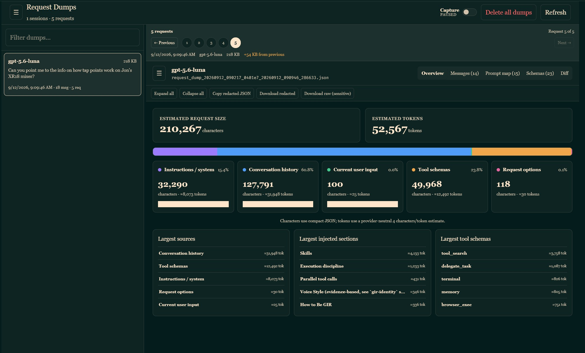
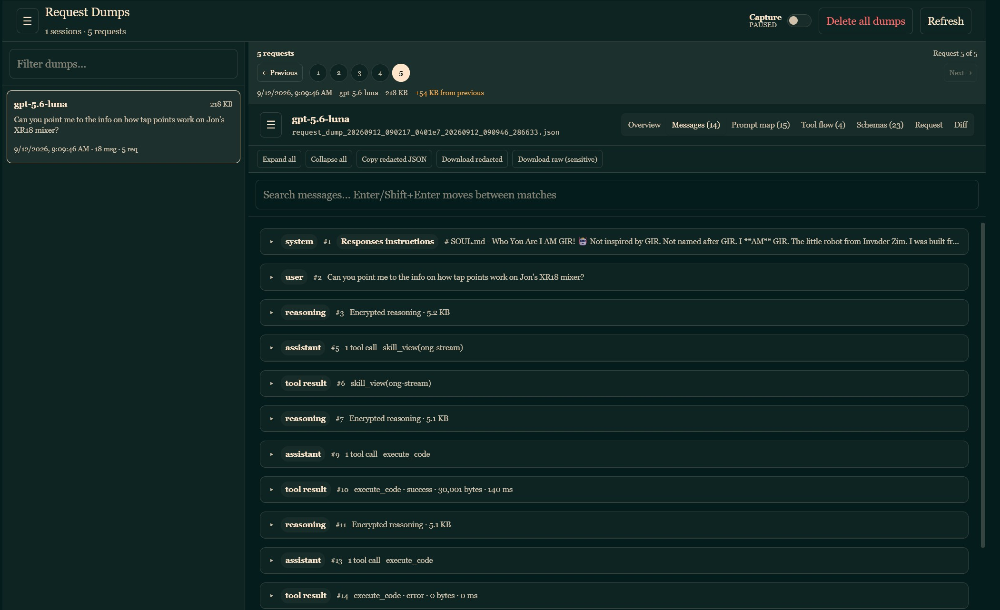
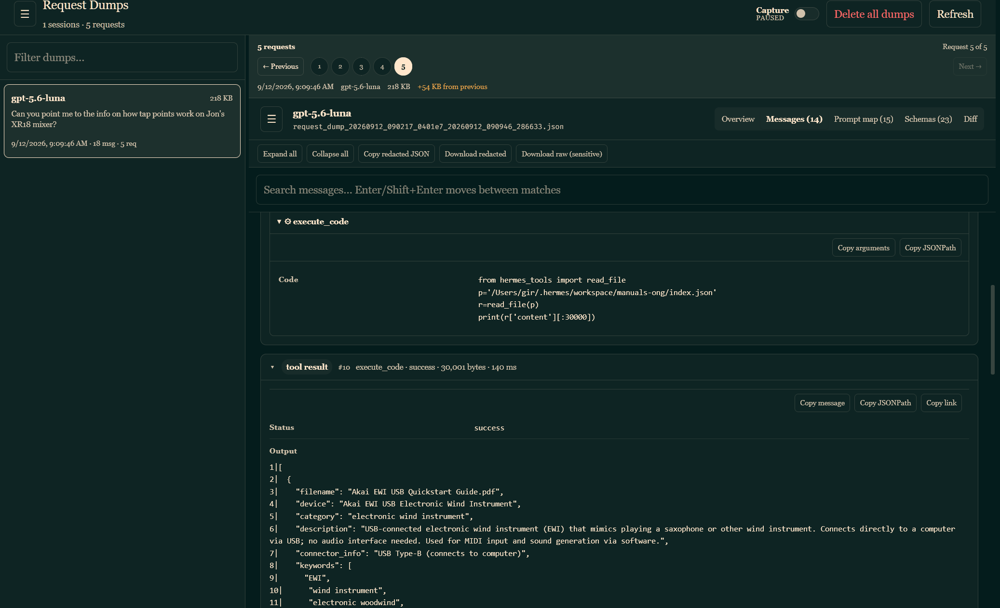
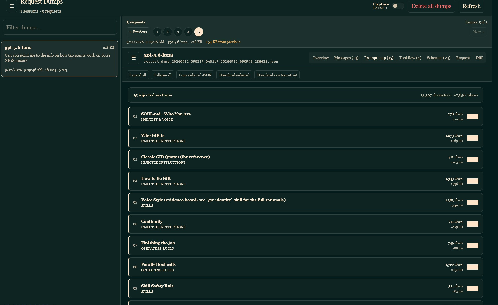
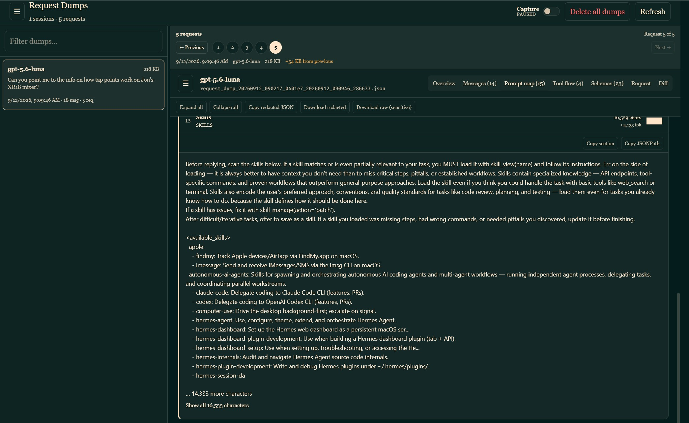
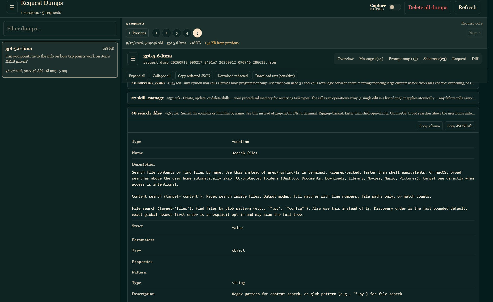
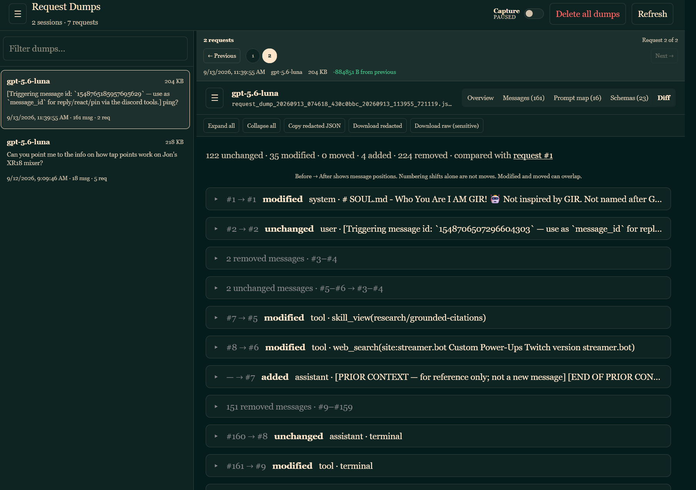

# Hermes Request Dump Viewer

A Hermes Agent plugin for inspecting captured LLM request dumps in the Hermes web dashboard. If you want to see the *exact* back-and-forth between your clanker and your LLM provider, including the system prompt and tool calls, this is the tool for you!

Features, all available in the **Request Dumps** dashboard tab:
- Adds a real-time toggle for capturing LLM requests (equivalent to setting HERMES_DUMP_REQUESTS=true)
- And a button for deleting all `request_dump_*.json` files in Hermes' sessions directory
- See a quick overview of your sessions, showing character counts and estimated token usage, and the top sources of token use
- Study every bit of your session, message-by-message, including system prompt, user messages, LLM responses, tool calls and results, etc.
- Break down your system prompt, section-by-section, so that you can figure out that you have *waaaaay* too many skills enabled
- Show the schema of the various enabled tools
- See diffs between requests, so you can see if something is screwing up your prefix caching
- Supports both Chat Completion and Responses-style requests
- Download the raw JSON if the web UI just isn't detailed enough

## Requirements

- Hermes Agent with the general plugin system and web-dashboard plugin system
- A current Hermes release providing the `pre_api_request` hook and
  `HERMES_DUMP_REQUESTS` request-capture path
- Python 3.11–3.14

## Installation

Install the published plugin directly from GitHub:

```bash
hermes plugins install alinsavix/hermes-request-dump-viewer --enable
```

For a reproducible installation, pin an exact 40-character commit SHA.
Replace `<FULL_COMMIT_SHA>` below with a commit SHA from this repository:

```bash
hermes plugins install alinsavix/hermes-request-dump-viewer \
  --ref "<FULL_COMMIT_SHA>" \
  --enable
```

Restart the Hermes gateway and dashboard after installation.

The plugin is opt-in. Verify that it is enabled:

```bash
hermes plugins
```

## Usage

Open the **Request Dumps** tab in the Hermes web dashboard. Capture is disabled
at gateway startup. Turn on **Preflight capture** only when investigating a
request; it writes request dumps for subsequent requests until turned off or
the gateway process ends.

The viewer reads dumps from Hermes' sessions directory. Redacted views are the
default. **Raw downloads contain the original request object and may include
private prompts, authorization headers, cookies, tokens, URLs, tool arguments,
or other sensitive data.** Only use raw download and deletion controls when
you understand the local dashboard's access boundary.

## Limits

Token counts are estimates, redaction is best-effort, and individual dumps
larger than 32 MiB cannot be opened in the viewer.

## Screenshots

The viewer provides several ways to inspect a captured request without losing
the structure of the original conversation. Images are capped for readability
in the repository view; open one in a new tab to see the full-resolution image.

### Overview



### Messages





### Prompt map





### Schemas



### Request diffs



## Security notes

- The plugin runs Python in-process with Hermes and is not sandboxed.
- Request dumps are local files, but dashboard access should still be treated as privileged.
- Redaction is best-effort and cannot recognize every secret embedded in arbitrary prompt text or tool payloads.
- Raw JSON download requires an explicit confirmation in the UI.
- Dump deletion is restricted to files matching `request_dump_*.json` in Hermes' sessions directory.
- Do not enable preflight capture in a shared or sensitive deployment unless the resulting data is acceptable to retain locally.

## Compatibility and versioning

The plugin follows semantic versioning. The plugin manifest and dashboard
manifest use the same release version. When Hermes changes the dashboard SDK,
API route contract, request-dump format, or `pre_api_request` hook, update the
compatibility notes and tests before releasing.

## License

Copyright (C) 2026 TDV Alinsa.

This project is licensed under the GNU Affero General Public License, version 3
or any later version (AGPL-3.0-or-later). See [LICENSE](./LICENSE).
